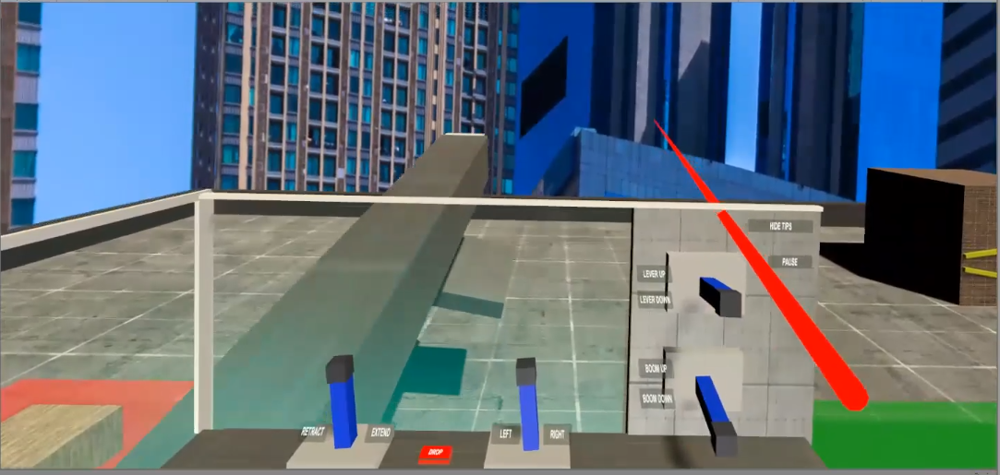

# Packet39-VRCraneSimulator-Team2

A virtual reality project created by Daniel Sharvaaya Dash, Jason Banks, Justin Taylor, and Mark Tony, as part of [XRTerra's AR & VR Developer Program](https://xrterra.com/programs/developer/), in association with [Packet39](https://packet39.com/).

## Description

This application creates a virtual reality simulation to help people learn how to use a crane. It involves using a lever and button-based control panel within the application to control the different movements of the crane.
The application can be used on the Oculus Quest w/ Link. 

## Installation

An executable .apk file can be found in the Builds folder.

## Built With

* [Unity](https://unity.com/)
  * Version: 2019.4.2f1
* [Microsoft Visual Studio Code](https://code.visualstudio.com/)
  * Version: 2019

## Development Setup

  * Ensure your PC is supported; the NVIDIA Titan X and all NVIDIA GTX 1070, 1080 and 16-series cards are supported. Likewise, all the new NVIDIA RTX 20-series cards are also supported; unfortunately, no AMD GPUs are supported as of now.
  * The PC must be running Windows 10, have at least 8GB of RAM, a spare USB 3.0 port and a CPU that is equivalent or greater than an Intel i5-4590/AMD Ryzen 5 1500X.
  * Update Quest firmware (to version 11.0 or higher) and Oculus App on PC (to version 1.43 or higher)
  * Once all prerequisites are satisfied:
    1. Launch the Oculus app on PC.
    2. Turn on the Quest.
    3. Plug the Link cable into a USB 3.0 port on the PC, then plug the other end into the headset.
    4. If prompted with ‘Allow access to data’, select Deny.
    5. Next, there will be a prompt to Enable Oculus Link (beta), select Enable to begin remote rendering via Oculus Link.
    6. Open the project in Unity.
 
## Contact
 
Daniel Sharvaaya Dash - daniel.s.dash@gmail.com
 
Project Link: https://github.com/drash7/Packet39-VRCraneSimulator-Team2
 
## Contributing
 
We greatly appreciate any contribitions.
1. Fork the Project
2. Create your Feature Branch (`git checkout -b feature/CoolFeature`)
3. Commit your Changes (`git commit -m 'Add some CoolFeature'`)
4. Push to the Branch (`git push origin feature/CoolFeature`)
5. Open a Pull Request
 
 
 
 
 
